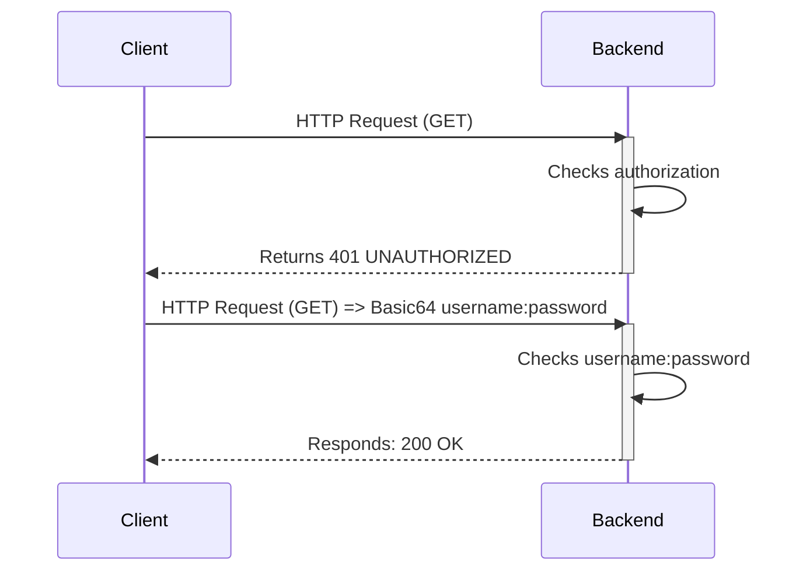

# Basic Authentication

```mermaid
sequenceDiagram
    participant Client
    participant Backend
    Client->>Backend: HTTP Request (GET)
    activate Backend
    Backend->>Backend: Checks authorization
    Backend-->>Client: Returns 401 UNAUTHORIZED
    deactivate Backend
    Client->>Backend: HTTP Request (GET) => Basic64 username:password
    activate Backend
    Backend->>Backend: Checks username:password
    Backend-->>Client: Responds: 200 OK
    deactivate Backend

```
